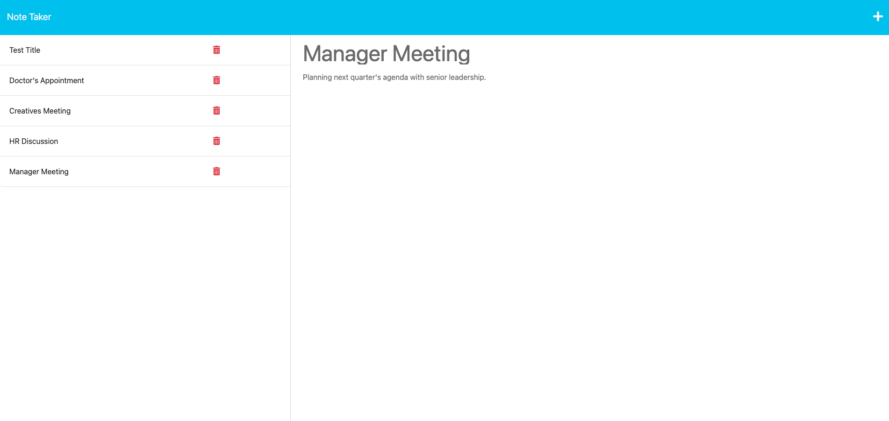

# Note Taker

As specified in the Challenge Acceptance Criteria, the note taker achieves the following:

✨ A landing page with a link to a notes page.

✨ A page with existing notes listed in the left-hand column, plus empty fields to enter a new note title and the note’s text in the right-hand column.

✨ A save icon appears in the navigation at the top of the page.

✨ The Save icon saves a new note, which appears in the left-hand column with the other existing notes.

✨ Clicking on an existing note makes it appear in the right-hand column.

✨ The Write icon presents empty fields to enter a new note title and the note’s text in the right-hand column.

Below is a screenshot of my latest and greatest:

For your next note-taking session, click [here](https://willyb-notetaker.herokuapp.com).
